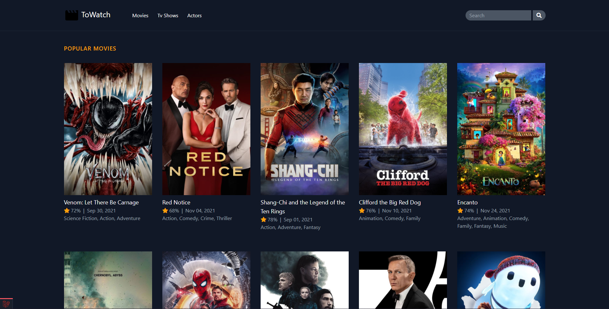

# Larajobs



## Description

WhereToWhatch is a web application built with the tallstack, where users can search for movies and tv shows and check the providers available!

## Technology used

- PHP 8
- Laravel 8
- Tailwind 2
- Alpine.js

## Requirements

-   php: ^8.0
-   Laravel: ^8.0
-   Composer
-   npm

## Project Set up

1. First you need to clone this repo or download the zip and extract!
2. cd/get into your project
3. Install Composer Dependencies

```
composer install
```

4. Install NPM Dependencies

```
npm install
```

5. Create a copy of your .env file

```
cp .env.example .env
```

6. Generate an app encryption key

```
php artisan key:generate
```

7. Create an account at [themoviedb](https://www.themoviedb.org/) site.
8. Get the api key available by the themoviedb once you signup and set the MOVIEDBAPY variable in the .env file.

